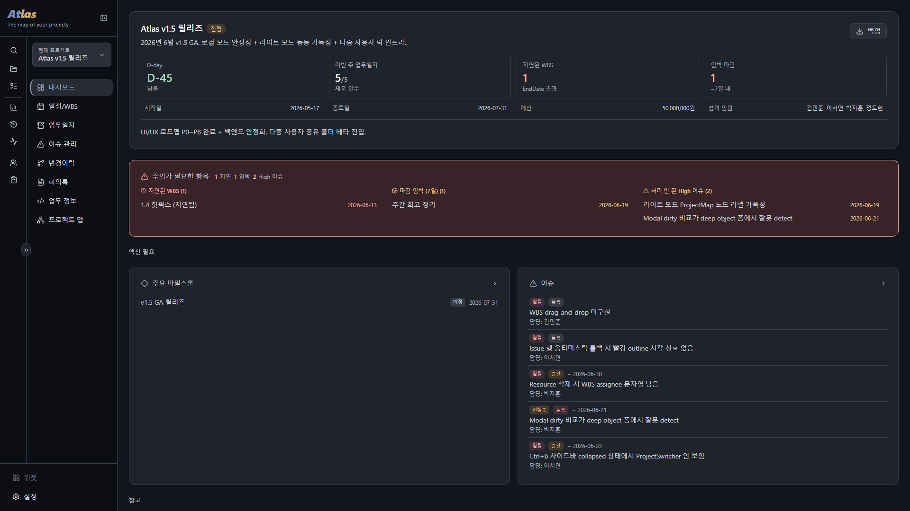
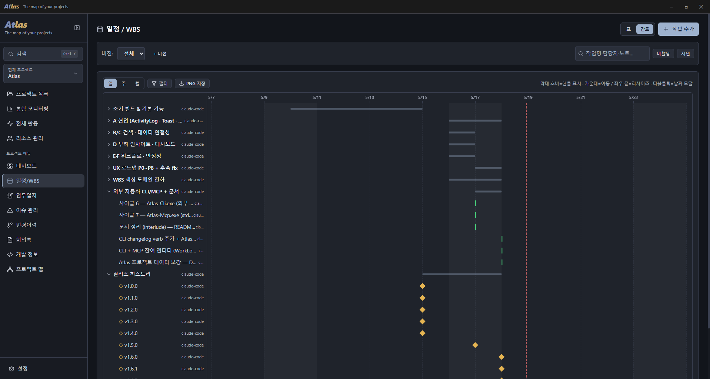
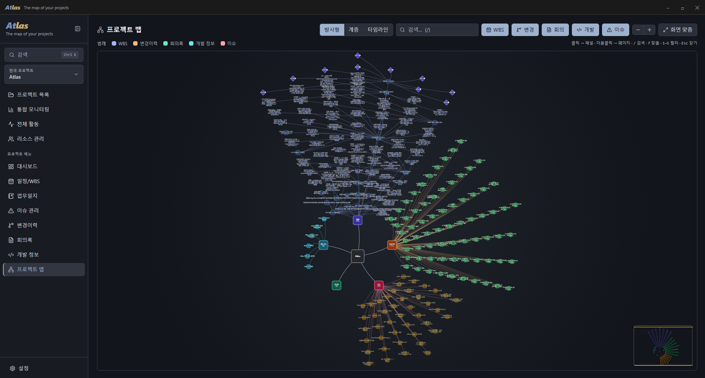
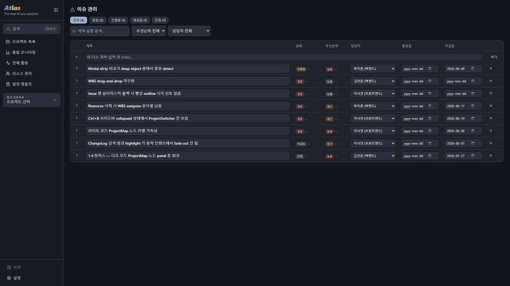
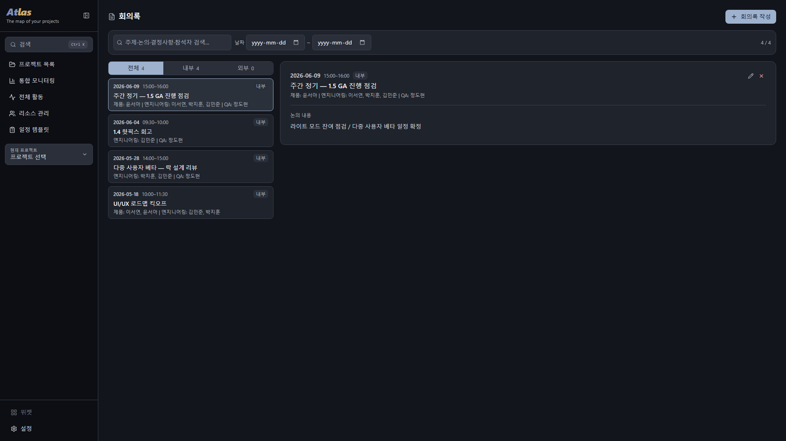
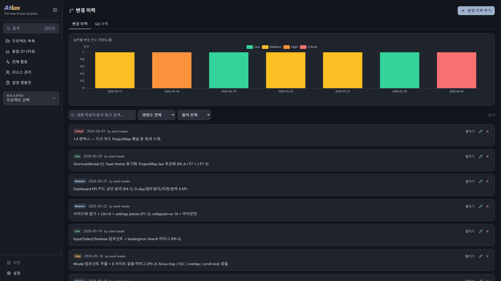
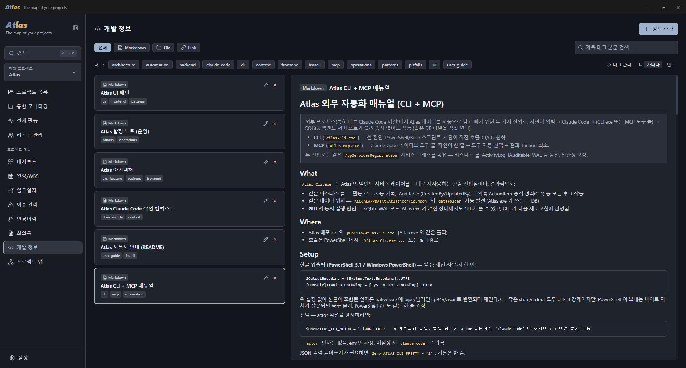
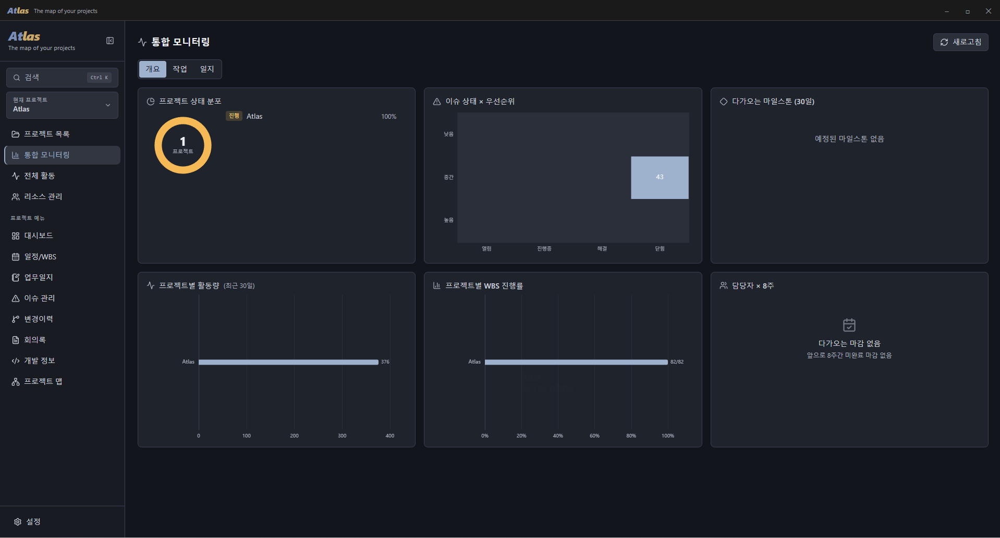
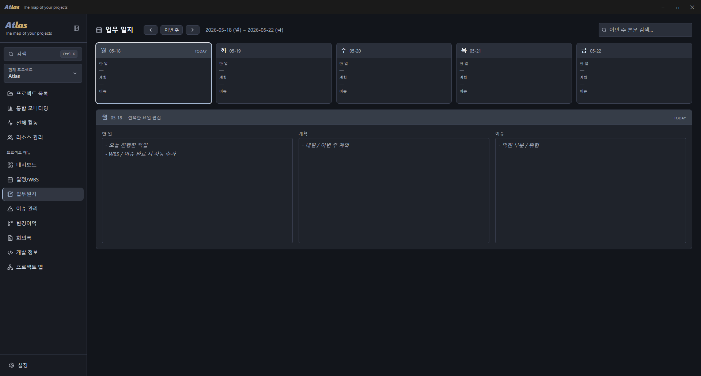

# Atlas

> *The map of your projects.* — 단일 사용자를 위한 로컬 우선 프로젝트 관리 데스크톱 앱.

📖 **[Read this in English ↓](#english)**

Atlas 는 한 사람이 여러 프로젝트의 일정·이슈·회의·변경 이력·자료를 한 곳에서 관리하기 위한 Windows 데스크톱 앱입니다. 모든 데이터는 SQLite DB 와 프로젝트별 파일 폴더로 로컬에 저장됩니다 — 기본 위치는 `%USERPROFILE%\Documents\ProjectManager\` 이며, 설정에서 다른 폴더(예: 본인 멀티 디바이스용 외부 드라이브, 사내 SMB 공유 폴더)로 변경할 수 있습니다. 원격 백엔드나 계정 가입은 없습니다. WPF + WebView2 셸 안에서 ASP.NET Core 가 인프로세스로 실행되고 그 위에 React SPA UI 가 올라가는 구조입니다. UI 언어는 한국어·영어 (설정에서 전환, 기본 한국어).

또한 **외부 자동화(CLI · MCP · Claude Code 스킬)를 1급 기능으로** 지원합니다 — 에이전틱 AI 가 셸/도구 콜로 데이터를 조회·갱신하고, 한 작업의 관련 자료·깃 저장소·이슈·이력을 한 번에 모아(`wbs context`) 실제 개발까지 이어가도록 설계했습니다. 자세히는 아래 [외부 자동화](#외부-자동화-claude-code-등).

## 시작하기 (사용자)

- **Microsoft Store** (권장) — Microsoft Store 에서 **Atlas**(게시자 SlnU)를 검색해 설치합니다. 설치와 업데이트가 Store 를 통해 자동으로 관리되고, 별도 관리자 권한이 필요 없으며, WebView2 등 런타임 의존성도 함께 처리됩니다. 외부 자동화 도구(`atlas-cli`·`atlas-mcp` 명령)도 함께 설치됩니다. **일반 사용자는 이 방법을 권장합니다.**
- **설치형 (GitHub 릴리스)** — Store 를 쓸 수 없는 환경에서는 릴리스의 `Atlas-Setup-*.exe` 를 실행해 설치합니다. 관리자 권한 없이 현재 사용자 폴더에 설치되고 시작 메뉴에 등록되며, 새 버전이 나오면 앱이 알려주고 설정에서 받아 설치할 수 있습니다.
- **포터블 (GitHub 릴리스)** — `Atlas-*.zip` 을 받아 원하는 폴더에 압축 해제 후 `Atlas.exe` 실행. 외부 자동화용 `Atlas-Cli.exe`·`Atlas-Mcp.exe` 도 이 zip 에 함께 들어 있습니다 (아래 [외부 자동화](#외부-자동화-claude-code-등) 참고).

요구 사항:

- Windows 10 / 11.
- WebView2 Runtime — Windows 11 은 기본 포함, Windows 10 은 [Evergreen Runtime](https://developer.microsoft.com/en-us/microsoft-edge/webview2/) 설치 필요.

데이터 위치:

- 기본값: `%USERPROFILE%\Documents\ProjectManager\` — SQLite DB (`projectmanager.db`) + 프로젝트별 파일 폴더.
- 설정 > 데이터 > 저장 위치 에서 다른 폴더로 변경 가능 (예: 본인 멀티 디바이스용 외부 드라이브). 변경 후에는 Atlas 재시작이 필요합니다.

백업:

- **자동 백업** (권장) — 설정 > 자동 백업 에서 폴더를 지정하면 전체 데이터(DB + 첨부)를 주기적으로 zip 으로 내보냅니다 (보관 개수 관리). OneDrive·Dropbox 등 동기화 폴더를 지정하면 오프사이트 백업이 됩니다. "지금 백업" 으로 즉시 실행도 가능.
- 수동 — 데이터 폴더 전체를 복사하거나, 대시보드의 "백업" 버튼으로 프로젝트 단위 zip 생성.

다중 사용자 (Client 모드):

같은 데이터를 팀이 같이 보려면 한 머신에서 `Atlas-Server.exe` 를 띄우고 다른 머신의 `Atlas.exe` 들이 그 서버에 붙는 방식입니다.

- **서버**: 릴리스의 `Atlas-Server-*.zip` 을 풀고 `run-server.cmd` 의 `ATLAS_API_KEY` 를 팀 공유 시크릿으로 바꾼 뒤 실행. 기본 5200 포트로 listen. 5200 인바운드 방화벽 허용 필요. 서버 머신의 `%LOCALAPPDATA%\Atlas\config.json` 의 `dataFolder` 가 진실 — 운영자가 직접 편집.
- **클라이언트**: `Atlas.exe` 실행 후 설정 > 연결 방식 → Client 선택 → 서버 URL (예: `http://atlas.intranet:5200`) + API 키 입력 → "테스트" → 저장 → Atlas 재시작.
- 같은 항목을 두 사람이 거의 동시에 편집하면 한쪽이 409 응답을 받습니다 (낙관적 동시성 토큰). 새로고침 후 재시도.
- TLS 는 평문 HTTP (사내 LAN 가정). 인터넷 노출이 필요하면 외부 reverse proxy + TLS 권장.

## 주요 기능

- **프로젝트 단위 관리** — 프로젝트 카드 목록, 대시보드 (개요·예산·인원·D-day·최근 활동 위젯), 프로젝트 단위 zip 백업.
- **글로벌 검색 · 명령 팔레트** — `Ctrl+K` 로 전 프로젝트·전 항목(프로젝트·WBS·이슈·회의·변경이력·업무 정보·업무 일지)을 전체 텍스트 검색(FTS5, 하이라이트·스니펫)하고 결과로 바로 이동, 명령도 실행.
- **WBS + 간트차트** — 계층 작업 트리, 마일스톤, 상태 (예정/진행/완료), 중요도, 멀티 담당자 칩 입력(Enter/콤마 단위), 버전 관리, 마크다운 노트, **관련 이슈·업무 정보 연결**(상세의 '관련 Issue'·'관련 정보' 섹션 — 한 작업에서 자료·깃 저장소·이슈를 바로 연결).
- **업무 일지** — 주 단위로 "한 일 / 계획 / 이슈" 3 필드를 일별로 마크다운 기록. 통합 모니터링에서 주간 md 파일 내보내기.
- **이슈 관리** — Open / InProgress / Resolved / Closed × Low / Medium / High, 표 위에서 BadgeMenu 로 인라인 상태 변경.
- **변경 이력** — 영향도 (Low ~ Critical), 일자별 스택 바 차트, 관련 문서·회의록 링크.
- **회의록** — 30 분 단위 시작/종료, 참석자, 논의 내용, 의사 결정, 액션 아이템 (담당자·마감일). 데이터 폴더의 `Meetings/` 에 사람이 읽기 좋은 md 로 자동 export (Obsidian 등 외부 리더 호환). 로컬 Claude CLI 가 있으면 논의 내용 'AI 요약' 옵션.
- **업무 정보** — 마크다운 (frontmatter + `DevInfo/` 폴더에 자동 export) / 파일 (Copy: 데이터 폴더 카피 / Reference: 원위치 경로만 저장) / 외부 링크 / 깃 저장소 (여러 개 등록, 우측에 커밋 이력 그래프) + 태그.
- **프로젝트 맵** — Cytoscape + dagre 그래프로 WBS·이슈·회의·변경·업무 정보 간 관계를 시각화 (정오각형 5 hub 방사형 / 타임라인 레이아웃, 미니맵).
- **모니터링** — 전 프로젝트 통합 뷰: 종합 시각화 4종 (프로젝트 상태 분포 / 이슈 상태×우선순위 매트릭스 / 다가오는 30일 마일스톤 / 프로젝트별 WBS 진행률), 오늘 예정 마일스톤, 금주·지난주 업무 일지.
- **리소스 관리** — 인원·장비 리소스, WBS 담당자 자동완성에 사용. 한 작업에 여러 담당자가 있어도 정확히 매칭.
- **외관·설정** — 다크/라이트 + **커스텀 색 테마**(핵심 12색 지정 → 나머지 자동 파생), **브랜드 워드마크·앱 아이콘 커스터마이즈**, 마크다운 글자 크기·줄간격, 최근 프로젝트 기억, 데이터 폴더 위치 변경(네이티브 폴더 다이얼로그), **설정 내보내기/가져오기**(JSON), **UI 언어 한국어·영어 전환**, **오픈소스 라이선스 고지**(설정 > 시스템).
- **자동 백업** — 전체 데이터(DB + 첨부)를 지정 폴더로 주기적으로 zip 백업(보관 개수 관리). 동기화 폴더(OneDrive 등) 지정 시 오프사이트 백업.
- **외부 자동화 · 에이전틱 AI** — `atlas-cli`(셸)·`atlas-mcp`(MCP)·Claude Code 스킬로 모든 데이터를 조회·생성·갱신. 전엔티티 DB-side 필터(상태·기간·담당자…)·출력 셰이핑(개수/축약/필드)·전 엔티티 전문 검색·작업 컨텍스트 번들(`wbs context`)로 에이전트가 "관련 정보 참고해 개발·상태 갱신" 까지 한 흐름으로. → [외부 자동화](#외부-자동화-claude-code-등).
- **자동 업데이트** — Microsoft Store 로 설치한 경우 Store 가 새 버전을 자동으로 업데이트합니다. GitHub 설치형(`Atlas-Setup-*.exe`)으로 받은 경우에는 앱이 주기적으로 GitHub 릴리스를 확인해 알려주고, 설정 > 업데이트 에서 직접 확인·다운로드·설치할 수 있습니다 (다운로드까지만 자동, 설치 실행은 사용자가 직접).
- **위젯 모드** — 데스크톱 한쪽에 항상 떠 있는 컴팩트 플로팅 위젯. 시계·날씨, 시스템 음악 재생 제어(Windows SMTC — 어떤 앱이든 재생 중인 곡의 제목·아트워크·재생/정지/이전/다음·타임라인), 최근 활성 창(머문 시간), 오늘 내 작업, 빠른 작성(이슈·변경이력·리소스). 사이드바 버튼 또는 `Ctrl+Alt+W` 로 토글하고 투명도·항상 위 고정·확장(2열)·크기 조정·드래그를 지원합니다. (데스크톱 전용)

## 외부 자동화 (Claude Code 등)

Atlas 는 두 가지 외부 진입로를 제공합니다 — `Atlas-Cli.exe` (CLI) 와 `Atlas-Mcp.exe` (MCP 서버). **Microsoft Store 설치본에 함께 들어 있으며, App Execution Alias 로 터미널 어디서나 `atlas-cli`·`atlas-mcp` 명령으로 호출됩니다.** GitHub 릴리스의 포터블 `Atlas-*.zip`(`publish/` 폴더)에도 단일 파일로 동봉됩니다(비스토어용).

- **CLI (`Atlas-Cli.exe`)** — PowerShell/Bash 셸에서 verb 호출. JSON 출력 → `ConvertFrom-Json` 파이프. CI/CD·사람이 직접 호출·스크립트 친화.
- **MCP 서버 (`Atlas-Mcp.exe`)** — Claude Code 가 stdio MCP 표준으로 직접 호출. 자연어 한 줄 → 도구 자동 선택 → DB 반영. 등록은 한 번:
  ```powershell
  # Microsoft Store 설치본: App Execution Alias (버전이 올라가도 안정 — 절대경로 불필요)
  claude mcp add --scope user atlas atlas-mcp
  # 포터블 zip: exe 절대경로
  claude mcp add --scope user atlas "C:\...\publish\Atlas-Mcp.exe"
  ```

- **Claude Code 스킬** — `atlas-cli skill install` 한 번이면 사용 가이드가 `~/.claude/skills/atlas` 에 설치되어, **어느 프로젝트에서 Claude Code 를 켜든** "atlas-cli 로 …" 한마디에 자동으로 적용됩니다(작업 컨텍스트 수집·필터 조회·상태 갱신 워크플로우 포함). 스킬은 Store·포터블·인스톨러 배포에 함께 동봉됩니다.

둘 다 GUI 와 같은 데이터 폴더를 자동 발견 (`%LOCALAPPDATA%\Atlas\config.json`), SQLite WAL 모드로 Atlas.exe 가 켜진 상태에서도 동시 안전. 활동 로그에 actor (`claude-code` / `claude-code-mcp`) 로 기록되어 GUI 활동 페이지에서 사람 작업과 분리 추적. Store 설치본의 alias 는 GUI 와 같은 패키지로 실행돼 데이터 뷰가 항상 일치합니다.

도구 74 종 (project · issue · wbs(+context) · todo(+my-work) · template · meeting · changelog · worklog · devinfo · resource(+용량/가동률) · 일정(의존성·임계경로·리스케줄·plan) · 연결 · search) · 전엔티티 필터/셰이핑 · 에이전틱 워크플로우 · CLI vs MCP 선택 매트릭스는 [`ATLAS-CLI-USAGE.md`](./ATLAS-CLI-USAGE.md)(라우터) + `cli-docs/`.

## 스크린샷

### 대시보드 — KPI · 주요 마일스톤 · 이슈 · 최근 회의록·변경 이력 위젯


### WBS + 간트차트 — 계층 트리 · 마일스톤 · 드래그 reorder · 표↔간트 정렬 통일


### 프로젝트 맵 — Cytoscape + dagre. 5 hub 방사형 / 타임라인 레이아웃 + 미니맵


### 이슈 관리 — 인라인 BadgeMenu (viewport flip), 상단 quickadd 행


### 회의록 — 결정 / 논의 / Action Items + `Meetings/` 자동 md export


### 변경 이력 — 영향도 · 출처 (Issue/WBS) · 일자별 스택 차트


### 업무 정보 — Markdown / File (Copy·Reference) / Link / GitRepo + 태그


### 통합 모니터링 — 전 프로젝트 종합 시각화 + 담당자 × 마감 히트맵


### 업무 일지 — 주간 한 일 / 계획 / 이슈, 마크다운 export


## 개발 (Contributor)

요구사항: **.NET 8 SDK · Node.js 20+ · PowerShell 5.1+** (Windows).

```powershell
dotnet tool restore
cd frontend; npm install; cd ..
./start.ps1              # backend :5200 + Vite :5173 + 브라우저
./publish.ps1            # publish/Atlas.exe + Atlas-Cli.exe + Atlas-Mcp.exe + wwwroot + zip
```

- 스택: **백엔드** .NET 8 / ASP.NET Core 8 / EF Core 8 (SQLite). **셸** WPF + WebView2. **프론트** React 19 + Vite + TypeScript + Tailwind 4 + Zustand + ECharts + Cytoscape.
- 레이어링: `Core` / `Application` / `Infrastructure` / `WebService` / `AppHost` / `DesktopApp` (Clean Architecture).
- `publish.ps1 -SkipZip` (zip 생략) · `-Server` (Client 모드용 standalone `Atlas-Server.exe`) · `-Msix -Version x.y.z.0` (Store 제출용 MSIX, CLI/MCP + Claude Code 스킬 동봉) · `-Installer` (설치형 `Atlas-Setup-*.exe`, Inno Setup 6 필요).

## 라이선스

독점 소프트웨어(Proprietary) — All rights reserved. 자세한 내용은 [`LICENSE`](./LICENSE) 참고. Copyright (c) 2026 SlnU.

개인정보 처리방침은 [`PRIVACY.md`](./PRIVACY.md) 참고.

---

## English

> *The map of your projects.* — A local-first project management desktop app for a single user.

Atlas is a Windows desktop application that lets one person manage schedules, issues, meetings, change logs, and notes across multiple projects in one place. All data is stored locally as a SQLite database and per-project file folders — the default location is `%USERPROFILE%\Documents\ProjectManager\`, but you can change it from Settings to any other folder (e.g. an external drive for multi-device use, or a corporate SMB share). No remote backend, no account. The shell is WPF + WebView2 hosting ASP.NET Core in-process, with a React SPA on top. The UI is available in Korean and English (switch in Settings; Korean by default).

It also treats **external automation (CLI · MCP · a Claude Code skill) as a first-class feature** — an agentic AI can query and update data over the shell/tool calls, gather everything related to one task (its notes, linked work info, git repos, issues, and history) in a single call (`wbs context`), and carry the work through to actual development. See [External automation](#external-automation-claude-code-etc) below.

### Getting started (end users)

- **Microsoft Store** (recommended) — search for **Atlas** (publisher SlnU) on the Microsoft Store and install. Installation and updates are managed automatically through the Store, no admin rights are needed, and runtime dependencies (WebView2 etc.) are handled for you. The external-automation commands (`atlas-cli` / `atlas-mcp`) are installed alongside it. **This is the recommended option for most users.**
- **Installer (GitHub release)** — if you can't use the Store, run `Atlas-Setup-*.exe` from the release. It installs per-user (no admin), adds a Start Menu entry, and the app notifies you when a new version is available so you can update from Settings.
- **Portable (GitHub release)** — download `Atlas-*.zip`, extract it to any folder, and run `Atlas.exe`. The external-automation tools (`Atlas-Cli.exe` / `Atlas-Mcp.exe`) are bundled in this zip too (see [External automation](#external-automation-claude-code-etc) below).

Requirements:

- Windows 10 / 11.
- WebView2 Runtime — bundled with Windows 11; on Windows 10 install the [Evergreen Runtime](https://developer.microsoft.com/en-us/microsoft-edge/webview2/).

Data location:

- Default: `%USERPROFILE%\Documents\ProjectManager\` — SQLite DB (`projectmanager.db`) plus per-project file folders.
- You can point this to a different folder (e.g. an external drive) from Settings > Data > Storage location. A restart is required after changing it.

Backup:

- **Automatic backup** (recommended) — pick a folder under Settings > Auto backup and Atlas periodically zips the full data (DB + attachments) there, with retention. Point it at a synced folder (OneDrive/Dropbox) for off-site backups. "Back up now" runs one immediately.
- **Manual** — copy the entire data folder, or use the dashboard's "Backup" button to produce a per-project zip.

Multi-user (Client mode):

To let a team share the same data, run `Atlas-Server.exe` on one machine and have other machines' `Atlas.exe` connect to it.

- **Server**: extract `Atlas-Server-*.zip` from the release, edit `ATLAS_API_KEY` in `run-server.cmd` to a shared team secret, run it. Listens on port 5200; allow inbound. The server's `%LOCALAPPDATA%\Atlas\config.json` (`dataFolder` field) is authoritative — edit it directly to relocate.
- **Client**: launch `Atlas.exe`, go to Settings > Connection mode → Client, enter the server URL (e.g. `http://atlas.intranet:5200`) and API key, "Test", Save, restart Atlas.
- Two people editing the same item nearly simultaneously will see one of them get a 409 response (optimistic concurrency token). Refresh and retry.
- TLS is plain HTTP (corporate LAN assumed). For internet exposure, put a reverse proxy with TLS in front.

### Features

- **Project hub** — Project card list, dashboard (overview, budget, members, D-day, recent activity widgets), per-project zip backup.
- **Global search · command palette** — `Ctrl+K` runs a full-text search (FTS5, with highlight/snippet) across every project and item type (projects, WBS, issues, meetings, change logs, work info, worklogs), jumps straight to a result, and runs commands.
- **WBS + Gantt chart** — Hierarchical task tree, milestones, status (Planned / InProgress / Done), priority, multi-assignee chip input (commit per Enter / comma), version management, Markdown notes, and **links to related issues & work info** (the detail panel's "Related issues" / "Related info" sections — wire a task to its notes, git repos, and issues in one place).
- **Worklog** — Weekly journal with three Markdown fields per day: Done / Plan / Issues. Export the week as a Markdown file from the monitoring page.
- **Issues** — Open / InProgress / Resolved / Closed × Low / Medium / High, with inline status edits via a portal-based BadgeMenu.
- **Change log** — Impact level (Low ~ Critical), stacked daily bar chart, links to related documents and meetings.
- **Meetings** — 30-minute time slots, attendees, discussion, decisions, action items (assignee, due date). Auto-exported as a human-readable Markdown file under `Meetings/` (compatible with Obsidian and other external readers). Optional 'AI summary' of the discussion when a local Claude CLI is present.
- **Work info** — item types: Markdown (auto-exported with frontmatter to `DevInfo/`) / File (Copy: copied into the data folder, or Reference: only the original absolute path is stored) / external Link / Git repository (register multiple, commit-history graph on the right) plus tagging.
- **Project map** — Cytoscape + dagre graph visualising relationships between WBS items, issues, meetings, change logs, and work info (regular-pentagon 5-hub radial / timeline layouts, minimap).
- **Monitoring** — Cross-project view: four summary charts (project-status breakdown / issue status×priority matrix / upcoming-30-day milestones / per-project WBS progress), today's milestones, and this/last week's worklogs.
- **Resources** — People and equipment, used as the autocomplete source for WBS assignees. Matches correctly even when a task has multiple assignees.
- **Appearance & settings** — Dark / light + **custom color theme** (pick 12 core colors, the rest auto-derived), **brand wordmark & app-icon customization**, Markdown font size and line height, remember last project, change data folder location (native folder picker), **settings export/import** (JSON), **Korean / English UI toggle**, **open-source license notices** (Settings > System).
- **Automatic backup** — Periodically zip the full data (DB + attachments) into a folder you choose, with retention. Point it at a synced folder (OneDrive/Dropbox) for off-site backups.
- **External automation · agentic AI** — Query, create, and update all data via `atlas-cli` (shell), `atlas-mcp` (MCP), and a Claude Code skill. Per-entity DB-side filters (status, dates, assignee…), output shaping (count/brief/fields), full-text search across entities, and a task-context bundle (`wbs context`) let an agent "gather the related info, then develop and update status" in one flow. → [External automation](#external-automation-claude-code-etc).
- **Automatic updates** — If you installed from the Microsoft Store, the Store updates the app automatically. For the GitHub installer (`Atlas-Setup-*.exe`), the app periodically checks GitHub Releases and notifies you when a newer version exists; you can check, download, and install from Settings > Update (download is automatic, running the installer is up to you).
- **Widget mode** — A compact, always-on-top floating widget. Clock & weather, system media controls (Windows SMTC — title, artwork, play/pause/prev/next, and a seekable timeline for whatever app is playing), recent active windows (with dwell time), today's tasks, and quick-create (issue / change log / resource). Toggle from the sidebar or `Ctrl+Alt+W`; supports adjustable transparency, always-on-top pin, an expanded 2-column layout, resizing, and dragging. (Desktop only.)

### External automation (Claude Code etc.)

Atlas provides two external entry points — `Atlas-Cli.exe` (CLI) and `Atlas-Mcp.exe` (MCP server). **They ship inside the Microsoft Store install and are exposed everywhere on your terminal PATH as the `atlas-cli` / `atlas-mcp` commands via App Execution Aliases.** They are also bundled as single-file executables in the portable `Atlas-*.zip` GitHub release (the `publish/` folder) for non-Store use.

- **CLI (`Atlas-Cli.exe`)** — verb-based shell entry for PowerShell / Bash. JSON stdout, pipe-friendly. Good for scripts, CI/CD, and direct use by humans.
- **MCP server (`Atlas-Mcp.exe`)** — stdio Model Context Protocol server consumed natively by Claude Code. One natural-language sentence → tool auto-selected → DB updated. Register once:
  ```powershell
  # Microsoft Store install: App Execution Alias (stable across version bumps — no absolute path)
  claude mcp add --scope user atlas atlas-mcp
  # Portable zip: absolute exe path
  claude mcp add --scope user atlas "C:\...\publish\Atlas-Mcp.exe"
  ```

- **Claude Code skill** — run `atlas-cli skill install` once and the usage guide is installed to `~/.claude/skills/atlas`, so **whichever project you open Claude Code in**, a request like "use atlas-cli to …" applies it automatically (including the gather-context / filter-query / update-status workflow). The skill is bundled in the Store, portable, and installer distributions.

Both auto-discover the same data folder as the GUI (`%LOCALAPPDATA%\Atlas\config.json`); SQLite WAL keeps writes safe while `Atlas.exe` is open. Each entry point stamps the activity log with its own actor (`claude-code` / `claude-code-mcp`) so external automation is filterable from human edits. On a Store install the aliases run under the same package identity as the GUI, so their data view always matches.

74 tools (project · issue · wbs(+context) · todo(+my-work) · template · meeting · changelog · worklog · devinfo · resource(+capacity/utilization) · scheduling(deps·critical-path·reschedule·plan) · links · search), per-entity filters/shaping, an agentic workflow guide, and a CLI-vs-MCP decision matrix are in [`ATLAS-CLI-USAGE.md`](./ATLAS-CLI-USAGE.md) (router) + `cli-docs/`.

### Screenshots

#### Dashboard — KPIs, milestones, issues, recent meetings & change log widgets


#### WBS + Gantt — Hierarchical tree, milestones, drag-reorder, table↔gantt unified sort


#### Project map — Cytoscape + dagre. 5-hub radial / timeline layouts with minimap


#### Issues — Inline BadgeMenu (viewport flip), top quickadd row


#### Meetings — Decisions / discussion / action items, auto Markdown export to `Meetings/`


#### Change log — Impact, source (Issue/WBS) backlinks, daily stacked chart


#### Work info — Markdown / File (Copy·Reference) / Link / GitRepo, tagging


#### Monitoring — Cross-project summary charts + assignee × deadline heatmap


#### Worklog — Weekly Done / Plan / Issues, Markdown export


### Development (Contributor)

Requirements: **.NET 8 SDK · Node.js 20+ · PowerShell 5.1+** (Windows).

```powershell
dotnet tool restore
cd frontend; npm install; cd ..
./start.ps1              # backend :5200 + Vite :5173 + browser
./publish.ps1            # publish/Atlas.exe + Atlas-Cli.exe + Atlas-Mcp.exe + wwwroot + zip
```

- Stack: **Backend** .NET 8 / ASP.NET Core 8 / EF Core 8 (SQLite). **Shell** WPF + WebView2. **Frontend** React 19 + Vite + TypeScript + Tailwind 4 + Zustand + ECharts + Cytoscape.
- Layering: `Core` / `Application` / `Infrastructure` / `WebService` / `AppHost` / `DesktopApp` (Clean Architecture).
- `publish.ps1 -SkipZip` (skip zip) · `-Server` (standalone `Atlas-Server.exe` for Client mode) · `-Msix -Version x.y.z.0` (Store-submission MSIX, bundles CLI/MCP + the Claude Code skill) · `-Installer` (build `Atlas-Setup-*.exe`, requires Inno Setup 6).

### License

Proprietary — All rights reserved. See [`LICENSE`](./LICENSE). Copyright (c) 2026 SlnU.

See [`PRIVACY.md`](./PRIVACY.md) for the privacy policy.
